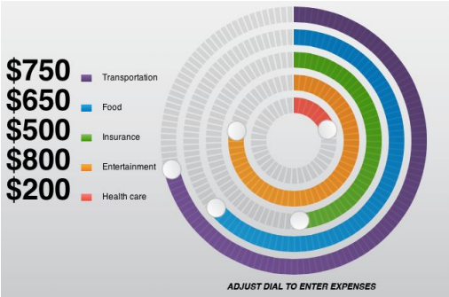

# Celtra frontend task

This is the repository for a frontend task I was by Celtra, as part of the interview process.

## Received instructions

### Circular slider

Create reusable circular slider class in javascript (as shown in image below). Make sure to
optimize the code for mobile performance.

**Notes**

- when creating new instance of the slider, pass in the options object
- multiple sliders can be rendered in the same container (see image below)
- each slider should have his own max/min limit and step value
- value number (on the left in the image) should change in real time based on the slider’s
- position
- make sure touch events on one slider don’t affect others (even if finger goes out of
- touched slider range)
- slider value should change when you drag the handle or if you tap the spot on a slider
- the solution should work on mobile devices
- without the use of any external JS libraries
- use GitHub to source your code (make sure you commit early and often)

**Options**

- container
- color
- max/min value
- step
- radius

**Example image**

